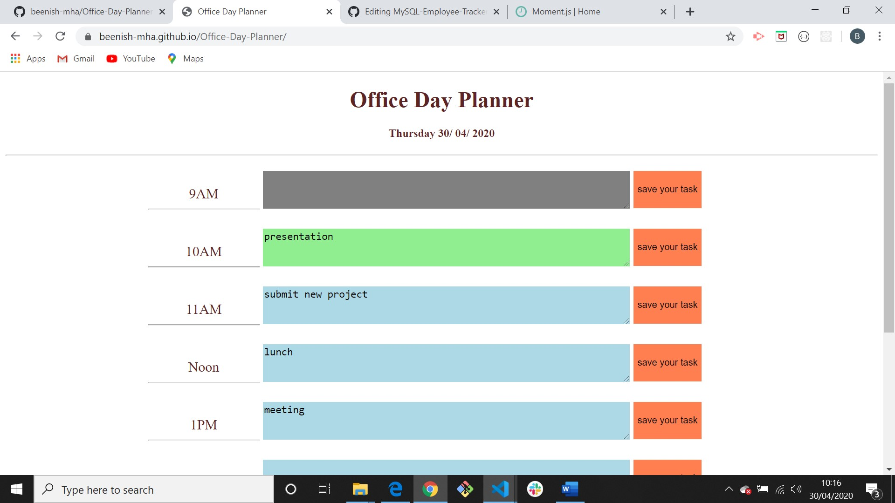

# Office-Day-Planner

## Description

Using a daily planner to create a schedule

When open the planner the current day is displayed at the top of the calendar
it shows the timeblocks for standard business hours

Each timeblock is color coded to indicate whether it is in the past, present, or future

User can enter an event when click the save button for that timeblock
the event is saved in local storage

When refresh the page the saved events persist

---

---

## How to use

https://beenish-mha.github.io/Office-Day-Planner/.

## Technologies used

- HTML
- CSS
- JQuery
- moment.js (Moment. js is a free and open source JavaScript library that removes the need to use the native JavaScript Date object directly. i used it for current date and current hour.)

## Author

Beenish Butt
